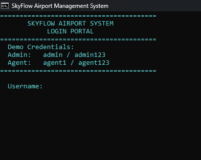
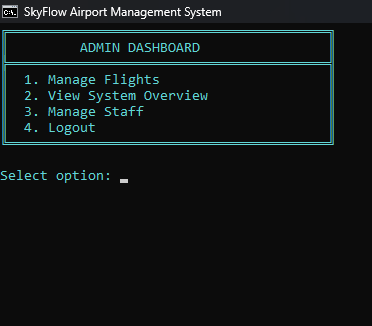
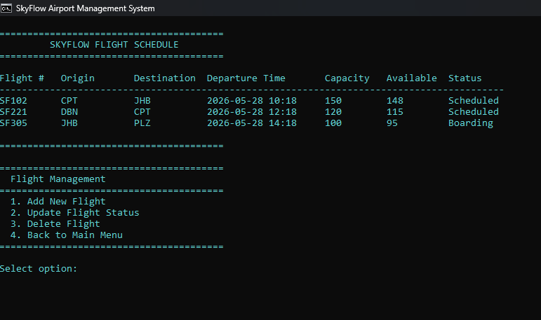
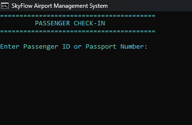
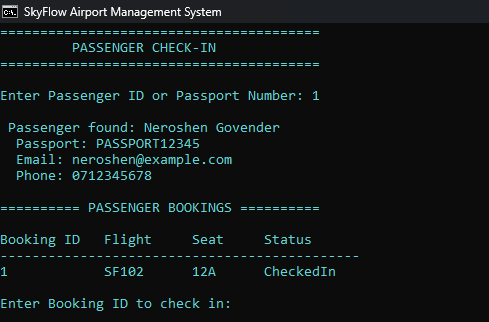

# SkyFlow - Airport Management System

SkyFlow is a C# and .NET airport management application that demonstrates role-based authentication, flight operations, passenger check-in, boarding workflows, SQL Server persistence, automated testing, and continuous integration.

The project was developed by **Ban Kanku** and demonstrates practical software development skills including Object-Oriented Programming, repository architecture, relational database design, secure password handling, input validation, automated testing, and Git version control.

---

## Application Preview

### Login and Authentication

SkyFlow provides role-based authentication for Administrators and Gate Agents.



### Administrator Dashboard

Administrators can manage flights, view system information, and manage staff accounts.



### Flight Management

Flight schedules display routes, departure times, aircraft capacity, available seats, and current flight status.



### Passenger Check-In

Gate Agents can search for passengers using a passenger ID or passport number.



### Successful Check-In

After a successful check-in, the passenger's booking status is persisted in SQL Server and the assigned seat is displayed.



---

## Key Features

### Authentication and Security

SkyFlow includes:

- Role-based authentication for Administrators and Gate Agents
- PBKDF2 password hashing with SHA-256
- Unique random password salts
- Constant-time password hash comparison
- Masked password entry
- Case-insensitive username authentication
- Input validation
- SQL-backed user authentication
- Environment-variable support for database configuration

Development accounts are created automatically when the `Users` table is empty. Passwords are hashed before being stored in SQL Server.

### Administrator Features

Administrators can:

- View scheduled flights
- Add new flights
- Update flight information and status
- Delete eligible flights
- View system statistics
- Monitor flight occupancy
- View staff accounts
- Create Administrator and Gate Agent accounts

### Gate Agent Features

Gate Agents can:

- View flight manifests
- Search passengers by ID or passport number
- View passenger booking information
- Check passengers in
- View assigned seats
- Start the boarding process
- Board checked-in passengers
- Update flight status during airport operations

---

## SQL Server Persistence

SkyFlow uses **SQL Server** as its runtime persistence layer and **Dapper** for database access.

The application contains dedicated SQL repositories:

```text
SqlUserRepository
SqlFlightRepository
SqlPassengerRepository
SqlBookingRepository
```

These repositories perform database operations for users, flights, passengers, and bookings.

The application connects to SQL Server through `DatabaseConnection.cs`.

A custom database connection can be supplied using:

```text
SKYFLOW_CONNECTION_STRING
```

This allows the database configuration to be changed without modifying application source code.

---

## Database Design

The SQL Server database is named:

```text
SkyFlowDB
```

The system uses four primary tables:

```text
Users
Flights
Passengers
Bookings
```

Their main relationship is:

```text
Passengers
    |
    |
Bookings -------- Flights

Users
    |
    |
Authentication and Staff Management
```

### Users

Stores staff authentication and account information:

- UserID
- Username
- PasswordHash
- FullName
- Role
- CreatedDate

### Flights

Stores flight information:

- FlightID
- FlightNumber
- Origin
- Destination
- DepartureTime
- AircraftCapacity
- AvailableSeats
- Status

### Passengers

Stores passenger information:

- PassengerID
- PassportNumber
- FullName
- Email
- PhoneNumber

### Bookings

Connects passengers to flights:

- BookingID
- FlightID
- PassengerID
- SeatNumber
- Status
- BookingDate

The database schema includes:

- Primary keys
- Foreign keys
- Unique constraints
- Role validation
- Flight-status validation
- Booking-status validation
- Aircraft-capacity validation
- Duplicate-seat prevention

All passenger information included with the project is synthetic demonstration data.

---

## Passenger Check-In Workflow

The check-in workflow demonstrates interaction between the application and SQL Server.

A Gate Agent can:

1. Search for a passenger by ID or passport number.
2. Retrieve the passenger from SQL Server.
3. View bookings associated with the passenger.
4. Select a confirmed booking.
5. Check the passenger in.
6. Persist the new `CheckedIn` status in SQL Server.

Because the booking status is stored in the database, the change remains available after the application is restarted.

---

## Boarding Workflow

SkyFlow also supports a boarding workflow.

Gate Agents can select an eligible flight, start boarding, retrieve checked-in passengers, update passenger booking statuses to `Boarded`, and update the flight status as airport operations progress.

---

## Object-Oriented Programming

SkyFlow demonstrates several OOP principles.

### Inheritance

`Admin` and `GateAgent` inherit common user functionality from the base `User` class.

```text
User
|-- Admin
|-- GateAgent
```

### Polymorphism

User types can provide role-specific behaviour through methods such as `DisplayDashboard()`.

### Encapsulation

Models, repositories, services, and database operations are separated into dedicated classes.

### Abstraction

Interfaces and repository classes separate application behaviour from data-access responsibilities.

---

## Repository Architecture

SkyFlow separates application models from data access.

The SQL-backed runtime repositories are:

```text
SqlUserRepository
SqlFlightRepository
SqlPassengerRepository
SqlBookingRepository
```

The original in-memory repositories remain in the project to support isolated automated unit tests without requiring a SQL Server instance during CI execution.

This allows the application to use persistent SQL data in normal operation while keeping automated tests fast and independent.

---

## Automated Testing

SkyFlow includes an **xUnit automated test project**.

The current test suite contains **17 automated tests** covering the in-memory repository layer, including:

- User authentication
- Invalid login handling
- Case-insensitive usernames
- Flight retrieval
- Flight creation
- Passenger retrieval
- Passport searches
- Passenger creation
- Booking retrieval
- Booking creation

Run the tests with:

```bash
dotnet test SkyFlow.Tests/SkyFlow.Tests.csproj
```

The test repositories are intentionally isolated from the SQL Server runtime repositories so the unit-test suite can execute without an external database.

---

## Continuous Integration

SkyFlow uses **GitHub Actions** for automated build and test validation.

For every push or pull request to `main`, the workflow:

1. Checks out the repository.
2. Configures .NET.
3. Restores application dependencies.
4. Restores test dependencies.
5. Builds the application in Release configuration.
6. Runs the automated xUnit test suite.

This helps detect build failures and test regressions before changes are accepted.

---

## Project Structure

```text
SkyFlow_Git/
|
|-- .github/
|   `-- workflows/
|       `-- dotnet-build.yml
|
|-- screenshots/
|   |-- admin-dashboard.png
|   |-- check-in-success.png
|   |-- flight-schedule.png
|   |-- login.png
|   `-- passenger-check-in.png
|
|-- SkyFlow/
|   |
|   |-- Database/
|   |   |-- BookingRepository.cs
|   |   |-- DatabaseConnection.cs
|   |   |-- DatabaseSeeder.cs
|   |   |-- FlightRepository.cs
|   |   |-- PassengerRepository.cs
|   |   |-- SqlBookingRepository.cs
|   |   |-- SqlFlightRepository.cs
|   |   |-- SqlPassengerRepository.cs
|   |   |-- SqlUserRepository.cs
|   |   `-- UserRepository.cs
|   |
|   |-- Interfaces/
|   |   |-- IDataRepository.cs
|   |   `-- IDisplayable.cs
|   |
|   |-- Models/
|   |   |-- Admin.cs
|   |   |-- Booking.cs
|   |   |-- Flight.cs
|   |   |-- GateAgent.cs
|   |   |-- Passenger.cs
|   |   `-- User.cs
|   |
|   |-- Services/
|   |   `-- TableRenderer.cs
|   |
|   |-- SQL/
|   |   `-- SETUPDATABASE.SQL
|   |
|   |-- Program.cs
|   `-- SkyFlow.csproj
|
|-- SkyFlow.Tests/
|   `-- Automated xUnit tests
|
|-- README.md
`-- .gitignore
```

---

## Technologies

SkyFlow uses:

- C#
- .NET 10
- SQL Server
- SQL Server Express
- Dapper
- Microsoft.Data.SqlClient
- xUnit
- LINQ
- Git
- GitHub
- GitHub Actions

---

## Getting Started

### Requirements

Install:

- .NET 10 SDK
- SQL Server Express
- Git

`sqlcmd` is useful for creating and inspecting the development database from the command line.

### Clone the Repository

```bash
git clone https://github.com/BanKanku/SkyFlow_Git.git
cd SkyFlow_Git
```

### Create the Database

The SQL Server setup script is located at:

```text
SkyFlow/SQL/SETUPDATABASE.SQL
```

The default development SQL Server instance is:

```text
.\SQLEXPRESS
```

The default database is:

```text
SkyFlowDB
```

With SQL Server Express and `sqlcmd` installed, the setup script can be executed from the repository root with:

```cmd
sqlcmd -S .\SQLEXPRESS -E -C -i "SkyFlow\SQL\SETUPDATABASE.SQL"
```

### Optional Custom Connection String

Instead of the default SQL Express connection, set:

```text
SKYFLOW_CONNECTION_STRING
```

to a valid SQL Server connection string before starting the application.

### Build

```bash
dotnet build SkyFlow/SkyFlow.csproj
```

### Run

```bash
dotnet run --project SkyFlow/SkyFlow.csproj
```

---

## Demo Accounts

For demonstration purposes, SkyFlow creates development accounts when the `Users` table is empty.

```text
Administrator
Username: admin
Password: admin123

Gate Agent
Username: agent1
Password: agent123
```

The development passwords are converted to salted PBKDF2 hashes before they are stored in the SQL Server `Users` table.

These accounts are intended only for local demonstration and portfolio use.

---

## Security Features

The project demonstrates several security-focused development practices:

- PBKDF2 password hashing
- SHA-256 password derivation
- Unique random salts
- Constant-time password verification
- Masked password input
- Parameterized database queries through Dapper
- Input validation
- Role-based access control
- Environment-variable database configuration

The included demo credentials are development credentials and should be replaced in a production deployment.

---

## Skills Demonstrated

This project demonstrates practical experience with:

- C# application development
- .NET
- Object-Oriented Programming
- SQL Server
- Dapper
- Repository architecture
- Relational database modelling
- Authentication and password security
- Role-based access control
- LINQ
- Input validation
- Exception handling
- Automated unit testing with xUnit
- Continuous integration with GitHub Actions
- Git version control
- Console application development

---

## Future Improvements

Possible future improvements include:

- SQL Server integration tests
- Passenger and booking administration
- Transaction-based boarding operations
- Improved seat inventory management
- Flight search and filtering
- CSV flight-manifest export
- Audit logging
- Additional reporting and analytics
- Migration to a desktop or web-based interface

---

## Developer

**Ban Kanku**

IT Student & Software Developer

C# | Java | Python | SQL

GitHub: **BanKanku**